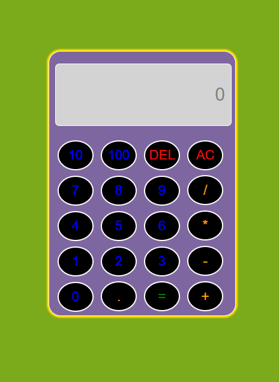

# Assignment:-5
 ## Topic:-HTML, CSS & JS
 OBJECTIVE:-Designing a <b>simple calculator</b> using <b>HTML,CSS & JS</b>. 

 
 <i>Screenshot of the webpage (Simple Calculator)</i>
 
 DEADLINE:-4th January 2023(06:01:01 AM) 
