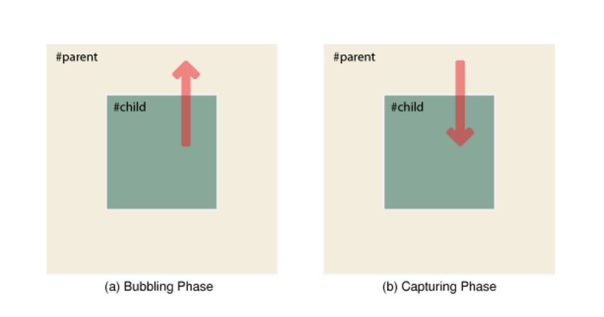

# Assignment:-6
 ## Topic:-Event Bubbling & Capturing
 OBJECTIVE:-Explainig <b>event bubbling</b> and </b> capture</b>  with an example. 
 <ul>
 <i>
 <li>In Event Bubbling, an event starts at the most specific element and then flows upwards (like bubble) towards the least specific element(or the window) . </li>
 <li>Bubbling happens bottom-to-top. </li>
 <li>If capture flag is false (default) ,event bubbling happens.  </li>

 

 

 <li>In Event Capturing, an event starts at the least specific element and then flows downwards towards the most specific element. </li>
 <li>Capturing happens top-to-bottom.  </li>
 <li>If capture flag is true ,event capturing happens.  </li>
 </i>
 </ul>
 DEADLINE:-11th January 2023(Before 08:08:08 AM) 
